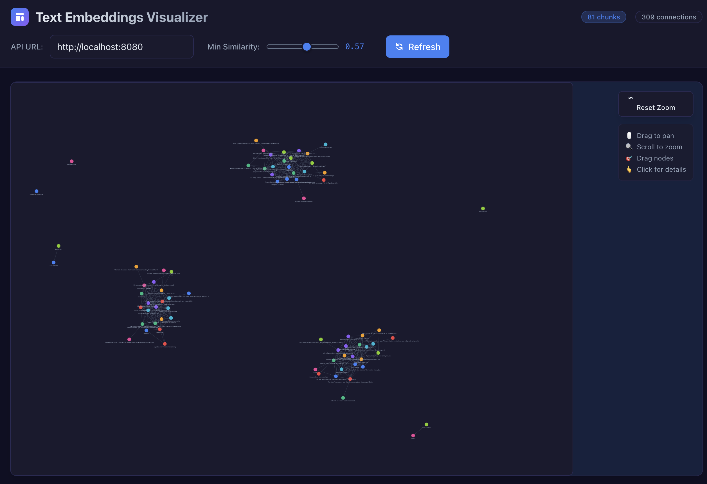
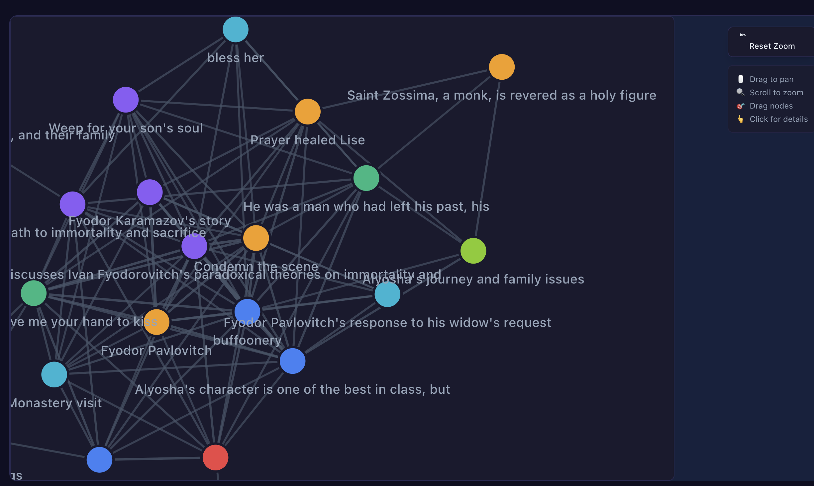

# BLUFfy

**BLUFfy** (bottom line up front-y) is a CLI tool for text analysis and knowledge discovery. It processes text documents by chunking them into paragraphs, generating embeddings and summaries using local AI models, calculating semantic similarities, and providing both API access and web visualization for exploring the relationships between text segments.

## Features

- **Text Processing**: Automatically chunks text files by paragraphs
- **AI-Powered Analysis**: Generates embeddings and summaries using Ollama/Nomic models
- **Similarity Analysis**: Calculates semantic relationships between all text chunks
- **SQLite Storage**: Stores all data in a portable SQLite database
- **REST API**: Serves data via HTTP API for integration and visualization
- **Web Visualization**: Interactive D3.js force graph for exploring text relationships
- **Concurrent Processing**: Multi-threaded processing for faster analysis

## Demo

Here's what BLUFfy can do:




## Prerequisites

Before using BLUFfy, you need to have [Ollama](https://ollama.ai) installed and running:

1. Install Ollama from [https://ollama.ai](https://ollama.ai)
2. Pull the required models:
   ```bash
   ollama pull nomic-embed-text  # For embeddings
   ollama pull qwen3:0.6b        # For summaries
   ```
3. Ensure Ollama is running: `ollama serve` (usually runs automatically)

## Data Structure

The graph uses the following data structure:

```go
type Node struct {
    ID        string  `json:"id"`
    File      string  `json:"file"`
    Title     string  `json:"title"`
    Paragraph string  `json:"paragraph"`
    FullText  string  `json:"fullText"`
    X         float64 `json:"x,omitempty"`
    Y         float64 `json:"y,omitempty"`
    VX        float64 `json:"vx,omitempty"`
    VY        float64 `json:"vy,omitempty"`
}

type Edge struct {
    Source     string  `json:"source"`
    Target     string  `json:"target"`
    Similarity float64 `json:"similarity"`
}

type GraphData struct {
    Nodes    []Node `json:"nodes"`
    Edges    []Edge `json:"edges"`
    Metadata struct {
        TotalParagraphs  int     `json:"totalParagraphs"`
        TotalConnections int     `json:"totalConnections"`
        Threshold       float64 `json:"threshold"`
        GeneratedAt     string  `json:"generatedAt"`
    } `json:"metadata"`
}
```

## Installation

### Option 1: Install from source

1. Ensure you have Go 1.21 or later installed:

   ```bash
   go version
   ```

2. Install BLUFfy:

   ```bash
   go install github.com/jcpsimmons/bluffy@latest
   ```

3. The binary will be available as `cli` in your `$GOPATH/bin` directory.

### Option 2: Build locally

1. Clone and build:
   ```bash
   git clone https://github.com/jcpsimmons/bluffy.git
   go build -o bluffy
   ```

## Usage

BLUFfy has two main commands: `process` to analyze text files and `serve` to start the API server.

### Process Text Files

Analyze a text file and generate embeddings:

```bash
# Basic usage
bluffy process -f document.txt

# Specify output directory and number of workers
bluffy process -f document.txt -o ./output -w 4

# Use custom Ollama host
bluffy process -f document.txt --ollama-host http://192.168.1.100:11434
```

This will:

1. Chunk your text file by paragraphs
2. Generate embeddings for each chunk using Nomic
3. Create summaries for each chunk
4. Calculate similarities between all chunks
5. Store everything in a SQLite database

### Start API Server

Serve the processed data via REST API:

```bash
# Basic usage (serves on port 8080)
bluffy serve document.db

# Custom port
bluffy serve document.db -p 3000
```

The API provides these endpoints:

- `GET /api/chunks` - All text chunks with embeddings
- `GET /api/similarities` - All similarity calculations
- `GET /api/graph?min_similarity=0.7` - Graph data for visualization

## Web Visualization

BLUFfy includes a React-based web visualizer in the `examples/visualizer/` directory that creates interactive D3.js force graphs:

1. Start the API server:

   ```bash
   bluffy serve your-document.db
   ```

2. In another terminal, start the web app:

   ```bash
   cd examples/visualizer
   npm install
   npm start
   ```

3. Open http://localhost:3000 to explore your text relationships visually

The visualization allows you to:

- Adjust similarity thresholds with a slider
- See connections between related text chunks
- Click on nodes to view the full text
- Drag nodes to reorganize the graph

## Command Options

### Process Command

- `-f, --file`: Input text file (.txt or .md) **(required)**
- `-o, --output`: Output directory for SQLite database (default: current directory)
- `-w, --workers`: Number of concurrent workers (default: number of CPUs)
- `--ollama-host`: Ollama server URL (default: http://localhost:11434)

### Serve Command

- `-p, --port`: Server port (default: 8080)

## Development

BLUFfy is built with:

- **Go 1.21+** for the CLI and API server
- **SQLite** for data storage
- **Ollama** with Nomic embeddings for AI processing
- **React + D3.js** for web visualization
